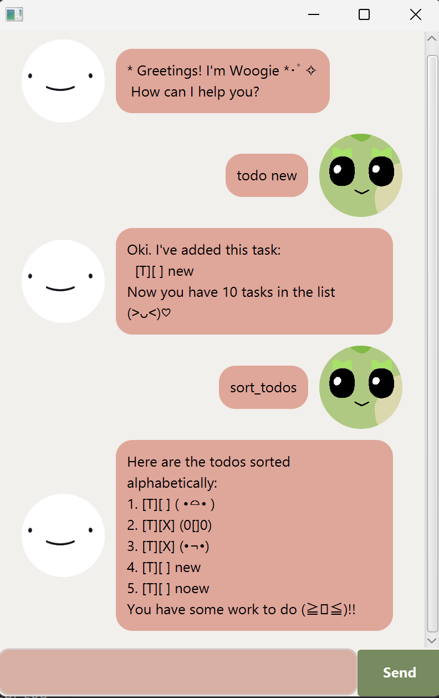

# Woogie User Guide



What is Woogie?
Woogie is THE task manager chatbot that keeps track of your tasks. It is:

- Easy to use
- Fast
- Efficient

## Features
### Adding tasks
Commands:
1. Add ToDos: `todo description`
2. Add Deadlines: `deadline description /by yyyy-MM-dd`
3. Add Events: `event description /from yyyy-MM-dd /to yyyy-MM-dd`

### Listing
The `list` command expects a list of the tasks currently stored.

For example, 
```
1. [T][] one
2. [T][] two
```

### Marking & Unmarking
1. `mark [task number]`
2. `unmark [task number]`

### Delete
`delete [task number]`

### Find
`find [keyword]`

### Sort
1. `sort_todos` sorts and returns the tasks of ToDo type alphabetically.
2. `sort_deadlines` sorts and returns the tasks of Deadline type in chronological order of the by date.
3. `sort_events` sorts and returns the tasks of Event type in chronological order of the from date.

### Close
The `bye` command saves all your tasks and cleanly exits the chatbot. Your tasks will be ready for your next vist!
